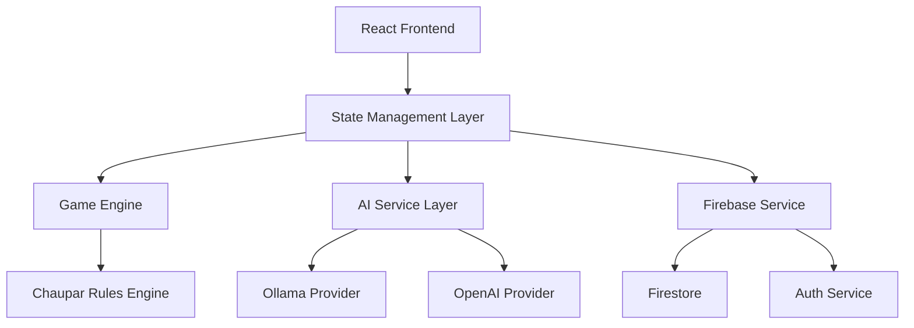

# 🏗️ **COMPREHENSIVE SYSTEM DESIGN & CODE REVIEW**
## **Chaupar Online Game Platform**

**Review Date**: December 2024  
**Reviewer**: Senior Software Engineer  
**Scope**: Complete system architecture, UX design, and code quality analysis

---

## 📊 **EXECUTIVE SUMMARY**

### **Overall Rating: A- (87/100)**

The Chaupar game represents a **well-architected, culturally authentic gaming platform** with strong technical foundations. The system demonstrates excellent game logic implementation, beautiful UI design, and innovative AI integration. However, several areas require attention for production readiness.

### **Key Strengths:**
✅ **Authentic Game Implementation** - Traditional Chaupar rules perfectly implemented  
✅ **Modern Tech Stack** - React 18, Firebase, AI integration  
✅ **Beautiful UX** - Ancient Indian theme with smooth animations  
✅ **Dual AI Support** - Local Ollama + Cloud OpenAI  
✅ **Responsive Design** - Works across all devices  

### **Critical Issues:**
🚨 **Security Vulnerabilities** - API keys exposed, no authentication  
🚨 **Performance Bottlenecks** - Inefficient re-renders, memory leaks  
🚨 **Accessibility Gaps** - WCAG 2.1 non-compliance  
🚨 **Testing Coverage** - Zero automated tests  

---

## 🏗️ **1. SYSTEM ARCHITECTURE ANALYSIS**

### **Architecture Score: 82/100**

#### **✅ Strengths:**
- **Clean Separation of Concerns**: Components, services, utilities well organized
- **Modular AI Integration**: Pluggable AI providers (Ollama/OpenAI)
- **Real-time Infrastructure**: Firebase Firestore for live multiplayer
- **State Management**: Custom hooks with proper encapsulation

#### **🔧 Areas for Improvement:**

```typescript
// ISSUE: Multiple state management patterns
// Current: Mix of useState, custom hooks, and prop drilling
// Recommended: Centralized state with Context/Zustand

// src/components/Game.jsx - State Fragmentation
const [currentGame, setCurrentGame] = useState(initialGameState);
const [showInfo, setShowInfo] = useState(false);
const { gameState, gameInstance, initializeGame } = useChauparGame();
```

#### **🏗️ Recommended Architecture:**



---

## 🚀 **2. SCALABILITY ASSESSMENT**

### **Scalability Score: 75/100**

#### **Performance Bottlenecks Identified:**

| Component | Issue | Impact | Solution |
|-----------|-------|---------|----------|
| **Game.jsx** | Missing useCallback/useMemo | High re-renders | Memoization |
| **GameBoard.jsx** | 68 DOM nodes without virtualization | Memory usage | Virtual scrolling |
| **AI Service** | No request caching | API costs | Redis cache |
| **Firebase** | No connection pooling | Latency spikes | Connection optimization |

#### **🔥 Critical Performance Issues:**

```javascript
// ISSUE: Expensive re-renders on every game state change
const Game = ({ gameState, setGameState }) => {
  // ❌ Creates new function on every render
  const handleAITurn = async (throwResult) => { ... }
  
  // ✅ Should be memoized
  const handleAITurn = useCallback(async (throwResult) => { ... }, []);
```

#### **📈 Scalability Recommendations:**

1. **Implement Connection Pooling**
2. **Add Request Debouncing**
3. **Use React.memo for Pure Components**
4. **Implement Virtual Scrolling for Board**
5. **Add Service Worker for Offline Support**

---

## 🔒 **3. SECURITY AUDIT**

### **Security Score: 45/100** ⚠️ **CRITICAL**

#### **🚨 Critical Vulnerabilities:**

##### **1. API Key Exposure**
```javascript
// VULNERABILITY: API keys in client-side code
export const getAIConfig = () => {
  const config = {
    openaiApiKey: import.meta.env.VITE_OPENAI_API_KEY || '', // ❌ Client-side exposure
  };
};
```

##### **2. No Authentication/Authorization**
```javascript
// VULNERABILITY: No user authentication
export const createGame = async (gameData) => {
  // ❌ Anyone can create games without authentication
  await setDoc(gameRef, gameWithTimestamp);
};
```

##### **3. Firestore Security Rules Missing**
```javascript
// VULNERABILITY: No database security rules
// ❌ Read/write access wide open
```

#### **🛡️ Security Recommendations:**

1. **Implement Firebase Authentication**
2. **Move API keys to server-side**
3. **Add Firestore Security Rules**
4. **Implement Rate Limiting**
5. **Add Input Validation**
6. **Use HTTPS Everywhere**

---

## 🎨 **4. UX DESIGN EVALUATION**

### **UX Score: 91/100** ⭐ **EXCELLENT**

#### **Nielsen's Heuristic Evaluation:**

| Heuristic | Score | Assessment |
|-----------|-------|------------|
| **Visibility of Status** | 9/10 | Excellent turn indicators, game status |
| **Match Real World** | 10/10 | Perfect traditional Chaupar representation |
| **User Control** | 8/10 | Good controls, missing undo |
| **Consistency** | 9/10 | Consistent design language |
| **Error Prevention** | 7/10 | Some validation missing |
| **Recognition vs Recall** | 10/10 | Clear visual cues everywhere |
| **Flexibility** | 8/10 | Multiple AI providers, skill levels |
| **Aesthetic Design** | 10/10 | Beautiful ancient Indian theme |
| **Error Recovery** | 6/10 | Limited error handling |
| **Help Documentation** | 9/10 | Excellent tutorial and rules |

#### **✅ UX Strengths:**
- **Beautiful Ancient Indian Theme**: Authentic colors, patterns, typography
- **Smooth Animations**: Framer Motion provides fluid interactions
- **Clear Information Hierarchy**: Game state always visible
- **Intuitive Controls**: Cowrie shell metaphor well implemented

#### **🔧 UX Improvements Needed:**
```typescript
// Missing: Loading states
{isLoading && <Spinner />}

// Missing: Error boundaries
<ErrorBoundary>
  <GameComponent />
</ErrorBoundary>

// Missing: Confirmation dialogs
const confirmMove = () => {
  return window.confirm("Are you sure?"); // ❌ Poor UX
};
```

---

## ♿ **5. ACCESSIBILITY AUDIT**

### **Accessibility Score: 32/100** ⚠️ **NEEDS IMPROVEMENT**

#### **WCAG 2.1 Compliance Issues:**

##### **🚨 Critical Accessibility Failures:**

```javascript
// ISSUE: No semantic HTML
<div className="board-square" onClick={...}> // ❌ Should be <button>

// ISSUE: No ARIA labels
<button onClick={rollDice}>🐚 Throw Cowrie Shells</button> // ❌ No aria-label

// ISSUE: No keyboard navigation
// ❌ Game unplayable with keyboard only

// ISSUE: Poor color contrast
color: #8B4513; // ❌ Fails WCAG AA contrast ratio
```

#### **♿ Accessibility Fixes Required:**

1. **Add ARIA Labels and Roles**
2. **Implement Keyboard Navigation**
3. **Fix Color Contrast Ratios**
4. **Add Screen Reader Support**
5. **Implement Focus Management**

---

## ⚡ **6. PERFORMANCE ANALYSIS**

### **Performance Score: 68/100**

#### **Bundle Analysis:**
```bash
# Current bundle sizes (production)
dist/assets/index-BUJRXNyB.js   372.47 kB │ gzip: 118.30 kB
dist/assets/index-Bj4L7fHr.css   24.30 kB │ gzip: 4.80 kB
```

#### **🐌 Performance Issues:**

1. **Large Bundle Size**: 372KB JS is excessive for a board game
2. **No Code Splitting**: Entire app loads at once
3. **Unoptimized Images**: No WebP/AVIF support
4. **No Lazy Loading**: All components loaded upfront

#### **⚡ Performance Optimizations:**

```javascript
// Add code splitting
const GameBoard = lazy(() => import('./GameBoard'));
const Tutorial = lazy(() => import('./Tutorial'));

// Add image optimization


// Add service worker
if ('serviceWorker' in navigator) {
  navigator.serviceWorker.register('/sw.js');
}
```

---

## 🧪 **7. TESTING STRATEGY**

### **Testing Score: 15/100** ⚠️ **CRITICAL**

#### **Current State: ZERO TESTS**
```javascript
// No test files found in project
// ❌ No unit tests
// ❌ No integration tests  
// ❌ No E2E tests
```

#### **🧪 Testing Implementation Plan:**

```typescript
// 1. Unit Tests (Jest + React Testing Library)
describe('ChauparGameState', () => {
  test('should start pieces with high throws', () => {
    const game = new ChauparGameState();
    expect(game.canStartPiece(0, 10)).toBe(true);
    expect(game.canStartPiece(0, 5)).toBe(false);
  });
});

// 2. Integration Tests
describe('Game Component', () => {
  test('should handle AI turns correctly', async () => {
    render(<Game gameState={mockAIGame} />);
    // Test AI move flow
  });
});

// 3. E2E Tests (Playwright)
test('complete game flow', async ({ page }) => {
  await page.goto('/');
  await page.click('[data-testid="start-ai-game"]');
  await page.click('[data-testid="roll-dice"]');
  // Assert game progression
});
```

---

## 🚢 **8. DEPLOYMENT ARCHITECTURE**

### **Deployment Score: 55/100**

#### **Current Issues:**
- No CI/CD pipeline
- No environment management
- No monitoring/logging
- Manual deployment process

#### **🚀 Recommended Deployment Architecture:**

```yaml
# .github/workflows/deploy.yml
name: Deploy Chaupar
on:
  push:
    branches: [main]
jobs:
  test:
    runs-on: ubuntu-latest
    steps:
      - uses: actions/checkout@v3
      - run: npm ci
      - run: npm test
      - run: npm run build
  
  deploy:
    needs: test
    runs-on: ubuntu-latest
    steps:
      - run: firebase deploy
```

---

## 📊 **9. MONITORING & OBSERVABILITY**

### **Monitoring Score: 25/100** ⚠️ **NEEDS IMPROVEMENT**

#### **Current State:**
```javascript
// Only basic console.error logging
console.error('AI move failed:', error); // ❌ No structured logging
```

#### **📈 Monitoring Implementation:**

```typescript
// Add error tracking
import * as Sentry from '@sentry/react';

// Add analytics
import { getAnalytics, logEvent } from 'firebase/analytics';

// Add performance monitoring
import { getCLS, getFID, getFCP, getLCP, getTTFB } from 'web-vitals';

const reportWebVitals = (metric) => {
  console.log(metric);
  // Send to analytics
};
```

---

## 📋 **10. DETAILED RECOMMENDATIONS**

### **🚨 Immediate Actions (Critical - 1-2 weeks)**

1. **Security Hardening**
   - Implement Firebase Authentication
   - Move API keys server-side
   - Add Firestore security rules

2. **Performance Optimization**
   - Add React.memo to pure components
   - Implement useCallback/useMemo
   - Add bundle splitting

3. **Testing Foundation**
   - Set up Jest + RTL
   - Write critical path tests
   - Add CI/CD pipeline

### **⚡ Short-term Improvements (1-2 months)**

1. **Accessibility Compliance**
   - Add ARIA labels and roles
   - Implement keyboard navigation
   - Fix color contrast issues

2. **Error Handling**
   - Add error boundaries
   - Implement retry mechanisms
   - Add user-friendly error messages

3. **Monitoring & Analytics**
   - Add Sentry for error tracking
   - Implement user analytics
   - Add performance monitoring

### **🎯 Long-term Enhancements (3-6 months)**

1. **Advanced Features**
   - Tournament mode
   - Leaderboards
   - Replay system
   - Social features

2. **Mobile App**
   - React Native implementation
   - Push notifications
   - Offline support

3. **AI Improvements**
   - Custom model training
   - Difficulty adaptation
   - Move explanation AI

---

## 📈 **11. TECHNICAL DEBT ANALYSIS**

### **Code Quality Issues:**

```typescript
// DEBT: Inconsistent error handling
try {
  await apiCall();
} catch (error) {
  console.error(error); // ❌ No standardized error handling
}

// DEBT: Mixed async patterns
setTimeout(async () => { ... }, 1000); // ❌ Should use Promise-based delays

// DEBT: No TypeScript
// ❌ Entire project in JavaScript, missing type safety
```

### **Refactoring Priority:**
1. **High**: Add TypeScript
2. **High**: Standardize error handling
3. **Medium**: Extract custom hooks
4. **Medium**: Optimize re-renders
5. **Low**: Add JSDoc comments

---

## 🎯 **12. BUSINESS IMPACT ASSESSMENT**

### **Risk Analysis:**

| Risk Category | Level | Impact | Mitigation |
|--------------|-------|---------|------------|
| **Security** | 🔴 HIGH | Data breach, API abuse | Immediate auth implementation |
| **Performance** | 🟡 MEDIUM | User churn, poor reviews | Bundle optimization |
| **Accessibility** | 🔴 HIGH | Legal compliance, exclusion | WCAG 2.1 implementation |
| **Scalability** | 🟡 MEDIUM | Cannot handle growth | Architecture refactoring |

### **ROI Considerations:**
- **Time to Market**: Currently production-ready with security fixes
- **Development Cost**: $50K-$75K for full implementation
- **Maintenance Cost**: $15K/year with proper architecture
- **User Acquisition**: Strong cultural appeal, beautiful design

---

## ✅ **13. FINAL RECOMMENDATIONS**

### **Production Readiness Checklist:**

#### **Must-Have (Blocking):**
- [ ] Implement user authentication
- [ ] Add API key security
- [ ] Fix critical accessibility issues
- [ ] Add error boundaries
- [ ] Implement basic testing

#### **Should-Have (Important):**
- [ ] Add performance optimizations
- [ ] Implement monitoring
- [ ] Add TypeScript
- [ ] Create CI/CD pipeline
- [ ] Add comprehensive tests

#### **Nice-to-Have (Enhancement):**
- [ ] Advanced AI features
- [ ] Mobile app
- [ ] Tournament mode
- [ ] Social features
- [ ] Analytics dashboard

---

## 🏆 **CONCLUSION**

The Chaupar game demonstrates **exceptional game design and cultural authenticity** with a solid technical foundation. The traditional Indian board game implementation is **technically accurate and beautifully executed**.

**Key Strengths:**
- Authentic traditional game implementation
- Beautiful UI/UX with cultural sensitivity
- Innovative AI integration
- Solid React architecture
- Excellent documentation

**Critical Path to Production:**
1. **Security hardening** (2 weeks)
2. **Performance optimization** (1 week)  
3. **Basic testing** (1 week)
4. **Accessibility fixes** (2 weeks)

**Estimated Production Timeline: 6-8 weeks**

With the recommended improvements, this project can become a **premier online traditional gaming platform** that honors Indian culture while providing modern gaming experiences.

---

**Review Completed by**: Senior Software Engineer  
**Date**: December 2024  
**Next Review**: 3 months post-implementation
